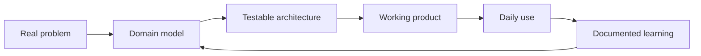

<h1 align="center">Hi, I'm Vitor Baradelli</h1>

  <strong>Full-stack developer building learning systems, personal software, and thoughtful productivity tools.</strong>

  
  
  

---

## What I'm About

I like turning real problems from my own life into software I can actually use.

My current focus is the intersection of **learning**, **personal knowledge management**, **spaced repetition**, **devotional routines**, and **AI-assisted workflows**. I care about building products with clear domain models, tests, documentation, and architecture that can grow without becoming painful.

Right now, I am especially interested in:

- building full-stack products with **TypeScript, React, Next.js, Node.js, Fastify, Prisma, PostgreSQL, SQLite, and Tailwind**;
- designing small but deep systems around real user workflows;
- using AI as a study and productivity assistant, while keeping humans in control;
- documenting what I learn so projects become useful to other developers too.

## Tech I Work With

  

## Featured Work

<table>
  <tr>
    <td width="50%">
      <h3><a href="https://github.com/Baradelli/english-glossary">English Glossary</a></h3>
      
A personal English-learning system for capturing vocabulary from real sources, reviewing it with SM-2 spaced repetition, and generating AI-assisted study prompts.

      
<strong>Engineering signal:</strong> hexagonal architecture, pure domain logic, Prisma + SQLite, Zod schemas, Vitest, TDD, and strong documentation.

    </td>
    <td width="50%">
      <h3><a href="https://github.com/Baradelli/devocional">Devocional</a></h3>
      
A devotional platform with API, PWA, admin panel, biblical content, personal notes, streaks, achievements, reminders, and rich editorial blocks.

      
<strong>Engineering signal:</strong> pnpm monorepo, Fastify, Prisma, PostgreSQL, React, Vite, TipTap, Web Push, Testcontainers, shared packages, and clean product boundaries.

    </td>
  </tr>
  <tr>
    <td width="50%">
      <h3><a href="https://github.com/Baradelli/second-brain">Second Brain</a></h3>
      
A personal knowledge management and productivity app that combines capture, daily rituals, library management, goals, spaced repetition, and optional AI assistance.

      
<strong>Engineering signal:</strong> mobile-first PWA, offline-friendly flows, shared schemas, Fastify backend, Prisma, PostgreSQL, rich text editing, and testable use cases.

    </td>
    <td width="50%">
      <h3><a href="https://github.com/Baradelli/Top-75-LeetCode-Study-Guide">Top 75 LeetCode Study Guide</a></h3>
      
A bilingual study guide with 75 organized LeetCode problems, explanations in Portuguese and English, and supporting material for algorithm practice.

      
<strong>Engineering signal:</strong> structured learning, clear categorization, bilingual technical writing, and a focus on fundamentals.

    </td>
  </tr>
</table>

## More Projects Worth Checking

  
  

## How I Think About Software

I am drawn to software that is useful before it is impressive. My favorite projects start as a personal itch, become a working tool, and then turn into a way to explain what I learned.

## Areas I'm Exploring

- **Learning systems:** spaced repetition, active recall, language learning, algorithms, and deliberate practice.
- **Personal software:** local-first or single-user tools that solve real problems without unnecessary infrastructure.
- **Full-stack architecture:** domain modeling, monorepos, APIs, validation, persistence, shared contracts, and tests.
- **AI-assisted products:** prompt workflows, human review, study helpers, and optional API integration.
- **Technical writing:** READMEs, study guides, architecture notes, and documentation that helps others understand the work.

## GitHub Activity

  
  

  

  

## Start Here

If you want to understand what I build and how I think, these repositories are the best entry points:

1. [English Glossary](https://github.com/Baradelli/english-glossary) - learning system, spaced repetition, AI-assisted study, architecture.
2. [Devocional](https://github.com/Baradelli/devocional) - product, monorepo, API, PWA, admin, reminders.
3. [Second Brain](https://github.com/Baradelli/second-brain) - personal knowledge management, productivity, AI, offline-friendly workflows.
4. [Top 75 LeetCode Study Guide](https://github.com/Baradelli/Top-75-LeetCode-Study-Guide) - algorithms, bilingual explanations, learning discipline.
5. [SaaS RBAC](https://github.com/Baradelli/sass-rbac) - authorization, roles, permissions, multi-tenant SaaS concepts.
6. [Gympass API](https://github.com/Baradelli/gympass-api) - backend rules, authentication, Fastify, Prisma, PostgreSQL, tests.

---

  <strong>Building in public, studying with intention, and turning learning into real software.</strong>

